# 🧠 Semantic Cache & Vector Metadata Indexer

A high-performance, polyglot system for **semantic caching** and **vector-based metadata indexing**, combining a **Python indexer** with a **Go proxy**. The system uses embedding-based similarity search to serve semantically equivalent cached responses without redundant computation, and indexes rich metadata alongside vector representations.

## Architecture



---

## 📁 Project Structure

```
.
├── indexer/               # Python — embedding, vector indexing, metadata storage
├── proxy/                 # Go — high-throughput HTTP/gRPC proxy with semantic cache
├── semantic-cache/
│   └── proto/             # Protocol Buffer definitions (shared contract)
└── .gitignore
```

---

## ✨ Features

- **Semantic Cache** — fuzzy cache hit detection using cosine similarity over vector embeddings; semantically equivalent queries return cached responses instantly
- **Vector Metadata Indexer** — stores arbitrary metadata alongside vector embeddings for rich, filterable retrieval
- **Go Proxy Layer** — handles request routing, cache lookups, and upstream forwarding with low-latency Go concurrency
- **Python Indexer** — sentence-transformer / embedding model integration for generating and storing vectors
- **gRPC / Proto Contract** — shared `.proto` definitions keep the Go and Python services in sync
- **Language split** — Python (64%) for ML-heavy indexing; Go (36%) for I/O-heavy proxy throughput

---

## 🛠️ Prerequisites

**Python Indexer**
- Python ≥ 3.9
- `pip` or `poetry`

**Go Proxy**
- Go ≥ 1.21

**Shared**
- `protoc` + language plugins if regenerating proto stubs
- A vector store backend (e.g. FAISS, Qdrant, Redis with vector search, or in-memory)

---

## 🚀 Getting Started

### 1. Clone the Repository

```bash
git clone https://github.com/izhan05803/A-Semantic-Cache-And-Vector-Meta-Data-Indexer-GO-PYTHON-.git
cd A-Semantic-Cache-And-Vector-Meta-Data-Indexer-GO-PYTHON-
```

### 2. Set Up the Python Indexer

```bash
cd indexer
pip install -r requirements.txt
```

Configure your embedding model and vector store in the indexer settings (e.g. `config.yaml` or environment variables):

```bash
export EMBEDDING_MODEL=sentence-transformers/all-MiniLM-L6-v2
export VECTOR_STORE_URL=http://localhost:6333   # e.g. Qdrant
export SIMILARITY_THRESHOLD=0.85
```

Start the indexer service:

```bash
python main.py
```

### 3. Set Up the Go Proxy

```bash
cd ../proxy
go mod tidy
go build -o proxy-server .
```

Configure the proxy to point at the Python indexer:

```bash
export INDEXER_ADDR=localhost:50051    # gRPC address of Python indexer
export UPSTREAM_URL=https://api.openai.com   # or your LLM / API upstream
export PROXY_PORT=8080
```

Start the proxy:

```bash
./proxy-server
```

### 4. (Optional) Regenerate Proto Stubs

If you modify `semantic-cache/proto/*.proto`:

```bash
# Python
cd semantic-cache/proto
python -m grpc_tools.protoc -I. --python_out=../../indexer --grpc_python_out=../../indexer *.proto

# Go
protoc -I. --go_out=../../proxy --go-grpc_out=../../proxy *.proto
```

---

## 🔄 How It Works

### Request Flow

1. A client sends a query to the **Go Proxy**.
2. The proxy forwards the query to the **Python Indexer**, which converts it to a vector embedding.
3. The indexer performs a **similarity search** against the vector store.
   - **Cache Hit (similarity ≥ threshold):** the cached response + metadata is returned to the proxy, which replies to the client immediately — no upstream call made.
   - **Cache Miss:** the proxy forwards the request to the upstream service, receives the response, and asks the indexer to **store** the new embedding + metadata for future hits.

### Semantic Cache

The cache keys are **not exact strings** — they are vector embeddings. Two queries that are semantically equivalent (e.g. `"What is the capital of France?"` and `"Which city is France's capital?"`) will resolve to the same cached entry if their cosine similarity exceeds the configured threshold.

### Vector Metadata Indexer

Alongside each cached vector, the indexer stores structured metadata (e.g. model used, timestamp, token count, tags). This allows:
- **Filtered retrieval** — retrieve only vectors matching certain metadata fields
- **Cache analytics** — inspect hit rates, latency, and cost savings per metadata dimension
- **TTL / eviction** — expire cache entries based on metadata timestamps

---

## ⚙️ Configuration Reference

| Variable | Component | Description | Default |
|---|---|---|---|
| `EMBEDDING_MODEL` | Indexer | HuggingFace or OpenAI embedding model name | `all-MiniLM-L6-v2` |
| `VECTOR_STORE_URL` | Indexer | URL for vector database | `localhost:6333` |
| `SIMILARITY_THRESHOLD` | Indexer | Cosine similarity floor for cache hit | `0.85` |
| `INDEXER_ADDR` | Proxy | gRPC address of Python indexer | `localhost:50051` |
| `UPSTREAM_URL` | Proxy | URL of the upstream API to proxy | — |
| `PROXY_PORT` | Proxy | Port the Go proxy listens on | `8080` |
| `CACHE_TTL_SECONDS` | Indexer | Time-to-live for cached vectors | `3600` |

---

## 📡 API Reference

### Go Proxy (HTTP)

```
POST /v1/*          — Proxies any request through the semantic cache
GET  /health        — Health check
GET  /metrics       — Prometheus-compatible metrics (hit rate, latency)
```

### Python Indexer (gRPC — defined in `semantic-cache/proto/`)

```protobuf
rpc Index(IndexRequest) returns (IndexResponse);   // Store vector + metadata
rpc Search(SearchRequest) returns (SearchResponse); // Similarity search
rpc Delete(DeleteRequest) returns (DeleteResponse); // Remove by ID or filter
```

---

## 🧪 Running Tests

**Python Indexer**
```bash
cd indexer
pytest tests/ -v
```

**Go Proxy**
```bash
cd proxy
go test ./... -v
```

---

## 📊 Performance Notes

- The Go proxy adds **< 1 ms** overhead on cache hits due to Go's native HTTP/gRPC handling and minimal GC pressure.
- The Python indexer is the slower path, used only on cache misses; consider running multiple instances behind a load balancer for high-throughput workloads.
- For production, prefer a dedicated vector database (Qdrant, Weaviate, Pinecone) over in-memory storage to survive restarts and support horizontal scaling.

---

## 🗺️ Roadmap

- [ ] Dashboard UI for cache hit/miss analytics
- [ ] Redis backend for distributed cache coordination
- [ ] OpenAI-compatible `/v1/chat/completions` drop-in proxy mode
- [ ] Streaming response support
- [ ] Docker Compose setup for one-command local deployment

---

## 🤝 Contributing

Pull requests are welcome. Please open an issue first to discuss major changes.

1. Fork the repository
2. Create your feature branch: `git checkout -b feature/my-feature`
3. Commit your changes: `git commit -m "feat: add my feature"`
4. Push: `git push origin feature/my-feature`
5. Open a Pull Request

---

## 📄 License

This project is open-source. See [LICENSE](LICENSE) for details.

---

## 👤 Author

**izhan05803** — [github.com/izhan05803](https://github.com/izhan05803)
